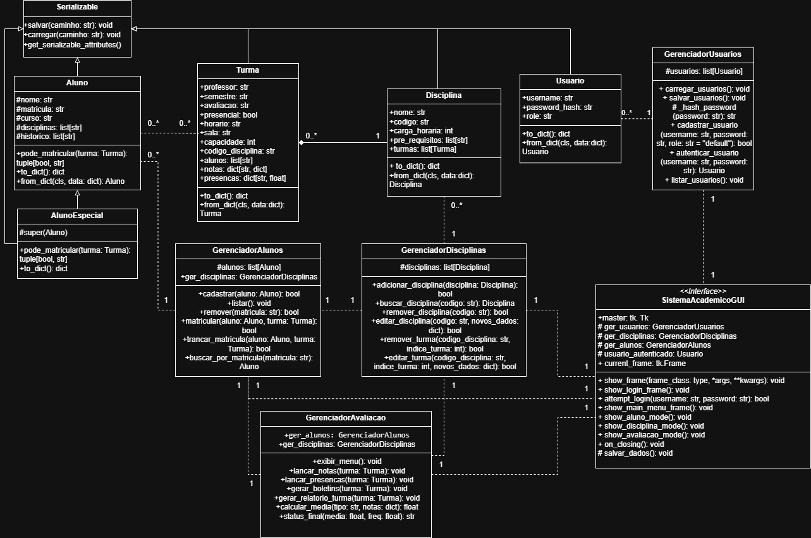

# Projeto Livre OO - Sistema Acadêmico

## Visão Geral do Projeto

Este projeto implementa um Sistema Acadêmico com funcionalidades básicas de gerenciamento de alunos, disciplinas, turmas, avaliações e autenticação de usuários. O sistema é desenvolvido em Python, e aplica os princípios da Programação Orientada a Objetos (POO). O `Tkinter` foi a ferramenta usada para implementar a interface gráfica de usuário básica (GUI).

## Funcionalidades Principais

* **Autenticação de Usuário**:
    * Tela de login para acessar o sistema.
    * Criação de usuário administrador padrão no primeiro acesso.
    * Armazenamento de senhas via hashing (`SHA256`).
* **Gerenciamento de Alunos**:
    * Cadastro, listagem, remoção e edição de alunos.
    * Matrícula de alunos em turmas, com validações de capacidade e pré-requisitos.
    * **Regra de Aluno Especial**: Limite de matrícula em 2 disciplinas por semestre.
    * Trancamento das matrículas em turmas.
    * Criação de um histórico de aprovações para controle de pré-requisitos.
* **Gerenciamento de Disciplinas e Turmas**:
    * Cadastro, listagem, remoção e edição de disciplinas.
    * Criação, listagem, remoção e edição de turmas associadas a disciplinas.
    * Validação de remoção de disciplina/turma se houver alunos matriculados.
    * Sistema de pré-requisitos para disciplinas (um aluno precisa ser aprovado em disciplinas anteriores para cursar disciplinas futuras).
* **Gerenciamento de Avaliações e Frequência**:
    * Lançamento de notas (P1, P2, P3, Listas, Seminário) e frequência para alunos em turmas.
    * Cálculo de média (simples ou ponderada) e status final (Aprovado, Reprovado por Nota, Reprovado por Falta).
    * Geração de boletins individuais e relatórios completos da turma.
    * Atualização automática do histórico de aprovações do aluno ao ser aprovado em uma disciplina.
* **Serialização de Dados**:
    * Todos os dados (alunos, disciplinas, turmas, usuários) são serializados em arquivos JSON no diretório `dados/`.
* **Interface Gráfica (GUI)**:
    * Feita usando `Tkinter`.
    * Navegação entre diferentes modos (Aluno, Disciplina/Turma, Avaliação/Frequência) com botões e janelas (`simpledialog`, `messagebox`).

## Conceitos de POO Aplicados

Conceitos utilizados:

* **Classes e Objetos**: Representação de entidades do mundo real (ex: `Aluno`, `Disciplina`, `Turma`, `Usuario`).
* **Encapsulamento**: Atributos e métodos internos são protegidos (`_`), e o acesso é controlado por métodos públicos ou propriedades (`@property`).
* **Herança**: `AlunoEspecial` herda de `Aluno`, especializando comportamentos.
* **Polimorfismo**: O método `pode_matricular` da classe `Aluno` é sobrescrito em `AlunoEspecial`, o que permite que o `GerenciadorAlunos` chame o método sem conhecer o tipo do aluno.
* **Associação e Composição**: Gerenciadores (`GerenciadorAlunos`, `GerenciadorDisciplinas`) associam-se a coleções de objetos (alunos, disciplinas). Enquanto, `Disciplina` e `Turma` mostram composição, onde turmas são partes integrantes de uma disciplina.
* **Mixins**: Utilização de `Serializable` para reforçar a capacidade de serialização (`to_dict`/`from_dict`) a diversas classes.
* **Injeção de Dependência**: As classes de GUI e os gerenciadores são instanciados com as dependências necessárias passadas via construtor (ex: `GerenciadorAlunos` recebe `GerenciadorDisciplinas`).

## Estrutura do Projeto
    ├── main.py                      # Ponto de entrada da aplicação (inicia a GUI)
    ├── package/
    │   ├── alunos/
    │   │   ├── aluno.py             # Definição das classes Aluno e AlunoEspecial (polimorfismo)
    │   │   └── cadastro.py          # Gerenciador das operações com Alunos
    │   ├── avaliacao/
    │   │   └── menu_av.py           # Lógica de avaliações (cálculo de notas, frequência, etc.)
    │   ├── disciplinas/
    │   │   ├── disciplina.py        # Definição da classe Disciplina
    │   │   ├── turma.py             # Definição da classe Turma
    │   │   └── cadastro.py          # Gerenciador de operações com Disciplinas e Turmas
    │   ├── gui/
    │   │   ├── app_gui.py           # Classe principal da GUI (gerencia frames e fluxo)
    │   │   ├── aluno_gui.py         # Interface gráfica para o Modo Aluno
    │   │   ├── disciplina_gui.py    # Interface gráfica para o Modo Disciplina/Turma
    │   │   └── avaliacao_gui.py     # Interface gráfica para o Modo Avaliação/Frequência
    │   ├── usuarios/
    │   │   └── cadastro_usuario.py  # Definição da classe Usuario e Gerenciador de Usuários
    │   └── utils/
    │       └── serializer.py        # Classe Mixin e Funções para salvar e carregar dados em JSON
    ├── tests/
    |    └── test_sistema.py         # Testes unitários
    └── dados/
        └── alunos.json              # Banco de dados de alunos
        └── disciplinas.json         # Banco de dados das disciplinas e turmas
        └── usuarios.json            # Banco de dados dos usuários cadastrados

## Como Executar o Projeto

1.  **Pré-requisitos**:
    * Python 3 instalado.

2.  **Executar a Aplicação**:
    python main.py

    * No primeiro acesso, se não houver um arquivo `dados/usuarios.json`, ou estiver vazio, o sistema solicitará o cadastro de um usuário administrador padrão via um diálogo Tkinter.
    * Utilize as credenciais cadastradas para fazer login e acessar o menu principal da aplicação:
    (usuário: admin,
    senha: admin123).

## Para Executar os Testes

Os testes do projeto, que contém alguns dos casos de uso, também podem ser executados:

1.  Abra o terminal na raiz do projeto (onde estão as pastas `package/` e `tests/`).
2.  Execute o comando:
    python -m unittest discover tests

    Isso executará todos os testes definidos na pasta `tests/`.

## Diagrama de Classes UML

Representação visual das classes e suas relações:

